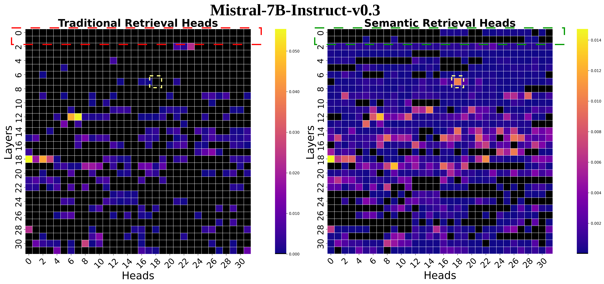

# CompressKV

This repository contains the code for the paper “CompressKV: Semantic Retrieval Heads Know What Tokens Are Not Important Before Generation”.

## 📖 Paper

Read the full paper: [CompressKV: Semantic Retrieval Heads Know What Tokens Are Not Important Before Generation(arXiv)](https://arxiv.org/abs/2508.02401v1)

## 🚀 Quick Start

### 1. Installation

```bash
# Create and activate a conda environment
conda create -n compresskv python=3.11 -y
conda activate compresskv

# Install PyTorch with CUDA support
conda install pytorch==2.3.1 torchvision==0.18.1 torchaudio==2.3.1 \
  pytorch-cuda=12.1 -c pytorch -c nvidia -y

# Install CUDA compiler
conda install nvidia/label/cuda-12.1.0::cuda-nvcc -y

# Install FlashAttention and other Python dependencies
pip install flash-attn==2.7.3
pip install -r requirements.txt
```

### 2. Running Evaluations

```bash
# LongBench evaluation for LLaMA and Mistral
./scripts/run_longbench.sh
# Get the LongBench score (edit eval_paths in this script to point to your result files)
./scripts/run_longbench_eval.sh   


# Needle-in-a-Haystack (NIAH) evaluation for LLaMA and Mistral
./scripts/run_needle.sh
# Visualize NIAH results (edit eval_paths and save_dir in this script)
./scripts/run_needle_visualization.sh   

# Masking-Based Ablation of Different Head Types for LLaMA
cd Retrieval_Head_Identification
./run_needle_mask_llama.sh
# Visualization of masking heads for LLaMA
python show_image_masking_head.py \
    --model <MODEL_NAME> \
    --eval_path <EVAL_PATH> \
    --save_dir <SAVE_DIR>

# Masking-Based Ablation of Different Head Types for Mistral
cd Retrieval_Head_Identification
./run_needle_mask_mistral.sh
# Visualization of masking heads for Mistral
python show_image_masking_head.py \
    --model <MODEL_NAME> \
    --eval_path <EVAL_PATH> \
    --save_dir <SAVE_DIR>
```

## 🛠️ Semantic Retrieval Heads Identification

```bash
cd Retrieval_Head_Identification

# Semantic retrieval heads
bash run_semantic_retrieval_head_identification.sh

# (Optional) Traditional retrieval heads
bash run_retrieval_head_identification.sh

# Extract top‑k head indices per layer
python get_retrieval_head_idx_per_layer.py \
  --input_file <YOUR_HEAD_JSON_FILE> \
  --output_file <YOUR_OUTPUT_JSON_FILE>
```

## 📈 Error‑Aware Scoring

```bash
# Compute per-layer compression error scores for each dataset
./scripts/run_longbench_get_score.sh 

# Average normalized errors across datasets
python longbench/get_avg.py \
  --input_file <PATH_TO_SCORE_JSONL> \
  --output_file <YOUR_OUTPUT_SCORE_JSON>
```

## 📊 Visualization

### Traditional vs. Semantic Retrieval Heads in Mistral Models



## 🤝 Acknowledgements

We thank the authors of the following open‑source projects for their foundational work:

* [Retrieval\_Head](https://github.com/nightdessert/Retrieval_Head)
* [KVCache-Factory](https://github.com/Zefan-Cai/KVCache-Factory)
* [Needle In A Haystack](https://github.com/gkamradt/LLMTest_NeedleInAHaystack)
* and other open‑source projects